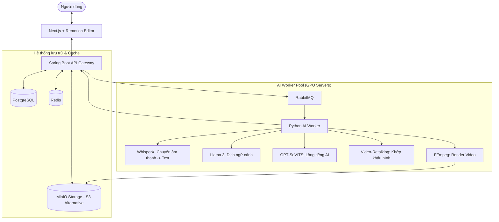

# Hệ Thống Website Dịch và Lồng Tiếng Video Phim Trung Quốc Sang Tiếng Việt

## Mô tả hệ thống

Tôi muốn thiết kế một website có khả năng dịch video các bộ phim ngắn từ tiếng Trung sang tiếng Việt bằng công nghệ AI. Hệ thống sẽ tự động:

- Nhận diện giọng nói tiếng Trung trong video.
- Chuyển đổi lời thoại sang văn bản.
- Dịch nội dung sang tiếng Việt.
- Tạo giọng nói tiếng Việt phù hợp.
- Xóa tiếng Trung gốc và lồng tiếng Việt vào video.

Mục tiêu của hệ thống là đảm bảo:
- Dịch đúng ngữ cảnh và hội thoại.
- Tự động hóa tối đa quy trình xử lý.
- Có khả năng chịu tải cao đối với các video dài từ 3–4 tiếng.
- Có khả năng mở rộng hệ thống trong tương lai.

---

# Các chức năng chính của hệ thống

## 1. Hệ thống Authentication & Authorization

Người dùng có thể:
- Đăng ký tài khoản.
- Đăng nhập hệ thống.
- Quên mật khẩu.
- Xác thực email.

Hệ thống cần phân biệt:
- Người dùng nào đang sử dụng hệ thống.
- Vai trò (Role) của người dùng.
- Gói dịch vụ đang sử dụng.

### Các gói dịch vụ

| Gói | Giá |
|---|---|
| Free | Miễn phí |
| Pro | 15 USD |
| Studio | 30 USD |
| Enterprise | Liên hệ |

Mỗi gói sẽ có:
- Giới hạn dung lượng upload.
- Giới hạn số phút video.
- Giới hạn số lượng AI processing.
- Giới hạn credit sử dụng.

---

# 2. Upload và xử lý video

Sau khi đăng nhập, người dùng có thể:
- Upload video.
- Theo dõi tiến trình xử lý.
- Nhận thông báo về gmail khi video đã hoàn tất.

Quy trình xử lý video:
1. Upload video.
2. Tách audio.
3. Speech-to-Text tiếng Trung.
4. AI Translate sang tiếng Việt.
5. AI Voice Generation tiếng Việt.
6. Đồng bộ voice với video.
7. Render video hoàn chỉnh.
8. Xuất video.

Hệ thống cần hỗ trợ:
- Video dung lượng lớn.
- Video dài 3–4 tiếng.
- Queue processing.
- Distributed processing.
- Retry khi xử lý lỗi.
- Background jobs.
- Auto scaling.

---

# 3. Hệ thống chỉnh sửa video online

Sau khi dịch xong, người dùng có thể chỉnh sửa video tương tự CapCut và xuất video ra sau khi đã chỉnh sửa xong

## Các tính năng editor

- Cắt video.
- Ghép video.
- Chèn text/content.
- Chèn icon/sticker.
- Chèn subtitle.
- Chèn nhạc.
- Điều chỉnh audio.
- Hiệu ứng chuyển cảnh.
- Timeline editing.
- Multi-track editing.
- Export nhiều chất lượng video (export video chất lượng cao sẽ rất tốn token)

---

# 4. Quản lý người dùng

Người dùng có thể:
- Xem thông tin cá nhân.
- Xem lịch sử xử lý video.
- Xem các video đã chỉnh sửa.
- Quản lý project.
- Xem credit còn lại.
- Quản lý gói subscription.

---

# 5. Phân tích mạng xã hội và đề xuất nội dung

Người dùng có thể liên kết tài khoản:
- YouTube
- Facebook
- TikTok
- Instagram

Sau khi kết nối:
- Hệ thống của mình có thể phân tích lượng người xem.
- Phân tích nội dung đang trending.
- Đề xuất các bộ phim phù hợp để dịch tiếp cho khách hàng.
- Gợi ý nội dung giúp tăng lượt xem và doanh thu.

---

# 6. Chức năng Enterprise Automation

Đối với khách hàng Enterprise, hệ thống có thể:

- Tự động tìm kiếm video/phim từ nền tảng Trung Quốc.
- Tự động tải video.
- Tự động dịch.
- Tự động lồng tiếng.
- Tự động render.
- Tự động đăng tải lên các nền tảng mạng xã hội.

Toàn bộ quy trình được tự động hóa bằng AI Pipeline.

---

# 7. Phương pháp phát triển (Development Methodology - Vibe Coding)

Hệ thống được phát triển theo triết lý **Vibe Coding** và **AI-First**:
- **Tối ưu hóa AI**: Sử dụng AI (Antigravity) để thiết kế kiến trúc Modular, giúp việc bảo trì và mở rộng cực kỳ nhanh chóng.
- **Tận dụng LLMs**: Quy trình phát triển không chỉ dừng lại ở viết code mà còn bao gồm việc thiết kế các Prompt tối ưu cho Llama 3/Whisper để đạt độ chính xác cao nhất trong dịch thuật và STT.
- **Phong cách cá nhân**: Mã nguồn được tổ chức khoa học, tuân thủ nghiêm ngặt các Design Patterns (Singleton, Factory, Observer) để đảm bảo tính thẩm mỹ của code và hiệu suất thực thi.

---

# Yêu cầu hệ thống

## Functional Requirements

- Authentication & Authorization.
- Video upload.
- AI Translation.
- AI Voice Cloning.
- Video rendering.
- Video editor online.
- Subscription management.
- Social media integration.
- Analytics dashboard.
- Automated enterprise pipeline.

---

# Non-Functional Requirements

## Performance
- **Tốc độ phản hồi**: Mục tiêu < 200ms cho các API thông thường.
- **Xử lý video lớn**: Hỗ trợ video 4K, dung lượng lên tới 2GB thông qua cơ chế Upload Chunked (Resumable).
- **Concurrent processing**: Xử lý song song hàng trăm tác vụ AI thông qua Distributed Workers.
- **Queue-based architecture**: Sử dụng RabbitMQ để tránh nghẽn server khi có nhiều yêu cầu xử lý video cùng lúc.
- **CDN streaming**: Tích hợp CDN để truyền tải video mượt mà trên toàn cầu.

## Scalability
- Horizontal scaling.
- Microservices architecture.
- Distributed workers.

## Reliability
- Retry mechanism.
- Fault tolerance.
- Backup & recovery.

## Security
- **JWT Authentication**: Sử dụng cơ chế Access Token và Refresh Token để bảo mật phiên đăng nhập.
- **RBAC (Role-Based Access Control)**: Phân quyền chặt chẽ đến từng tài nguyên (Admin, Studio, Pro, Free).
- **Data Protection**: Mã hóa thông tin nhạy cảm của người dùng (Password b-crypt), bảo vệ API bằng Rate Limiting và CORS.
- **Protection**: Ngăn chặn các lỗi bảo mật phổ biến như SQL Injection (thông qua Spring Data JPA), XSS (thông qua HTML Sanitization), và CSRF.
- **Secure File Storage**: Phân quyền truy cập Object Storage (MinIO) thông qua Pre-signed URLs.

---

# Gợi ý kiến trúc công nghệ (Tối ưu theo Project hiện có)

Mục tiêu: Tối ưu hóa chi phí bằng cách sử dụng tối đa các giải pháp Open Source, tự vận hành (Self-hosted) thay vì sử dụng các dịch vụ SaaS đắt đỏ (AWS, Google Cloud, HeyGen, OpenAI).

## 1. Frontend & Video Editor (Web-side)
- **Framework**: Next.js 14/15 (App Router) - Tối ưu SEO và tốc độ tải trang.
- **Video Rendering Engine**: **Remotion** (HTML/React-to-Video). 
    - Thay vì render trên server đắt đỏ, có thể tận dụng trình duyệt của client hoặc chạy Remotion Lambda trên hạ tầng tự có.
- **Client-side Processing**: **FFmpeg.wasm**.
    - Cho phép người dùng cắt ghép video cơ bản ngay trên trình duyệt mà không cần gửi dữ liệu về server, giảm tải băng thông và CPU server.
- **UI Components**: TailwindCSS + Shadcn/UI (Giao diện hiện đại, cao cấp).

## 2. Backend (Core System)
- **Framework**: **Java Spring Boot 2.3.0** (Tận dụng hệ thống Auth/RBAC hiện có).
- **API Documentation**: Swagger/OpenAPI.
- **Security**: Spring Security + JWT.
- **Real-time Updates**: Socket.io hoặc WebSocket (Thông báo trạng thái render video từng % một).

## 3. AI & Video Processing Pipeline (Self-hosted Workers)
Thay vì gọi API tốn phí của OpenAI/HeyGen, ta triển khai các Worker chạy Python trên GPU riêng (hoặc VPS GPU giá rẻ như RunPod/Vast.ai):

- **Speech-to-Text (STT)**: **WhisperX** hoặc **Faster-Whisper**.
    - Tốc độ nhanh hơn gấp nhiều lần Whisper gốc, hỗ trợ Speaker Diarization (nhận diện ai đang nói) và canh chỉnh thời gian (alignment) cực chuẩn để làm phụ đề.
- **Translation (LLM)**: **Llama 3 (8B/70B)** triển khai qua **vLLM** hoặc **Ollama**.
    - Miễn phí hoàn toàn, chất lượng tương đương GPT-3.5/4 cho việc dịch thuật hội thoại phim.
- **Text-to-Speech (TTS)**: **GPT-SoVITS** hoặc **Fish-Speech**.
    - Đây là các công cụ Open Source tốt nhất hiện nay để Voice Cloning (giữ nguyên tone giọng nhân vật gốc) với độ tự nhiên cao.
- **Lip-Sync (Video Retalking)**: **Video-Retalking** hoặc **Wav2Lip-GFPGAN**.
    - Thay thế HeyGen để khớp khẩu hình miệng nhân vật theo tiếng Việt. (Đây chính là phần "heygenframe" mà bạn đề cập).
- **Core Processor**: **FFmpeg** (Chạy đa luồng, tối ưu hóa qua GPU NVENC).

## 4. Infrastructure & Data Storage (Zero AWS Cost)
- **Object Storage**: **MinIO** (Self-hosted S3 alternative).
    - Cài đặt trực tiếp trên server để lưu trữ video gốc và video kết quả, không mất phí hàng tháng như AWS S3.
- **Database**: **PostgreSQL** + **Liquibase** (Quản lý schema).
- **Caching & Session**: **Redis**.
- **Message Broker**: **RabbitMQ**.
    - Quản lý hàng đợi xử lý video. Khi video dài 3-4 tiếng, hệ thống sẽ chia nhỏ video thành các đoạn (chunks) để xử lý song song trên nhiều Worker.

## 5. Deployment strategy
- **Containerization**: Docker & Docker Compose (Dễ dàng cài đặt trên bất kỳ VPS nào).
- **GPU Management**: Docker NVIDIA Runtime (Để các AI Models truy cập được GPU).
- **Monitoring**: Netdata hoặc Prometheus/Grafana (Theo dõi hiệu năng server).

---

# Kiến trúc hệ thống đề xuất (Open Source Flow)

